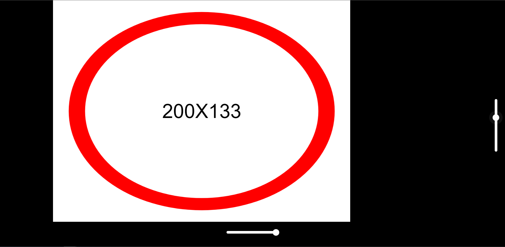
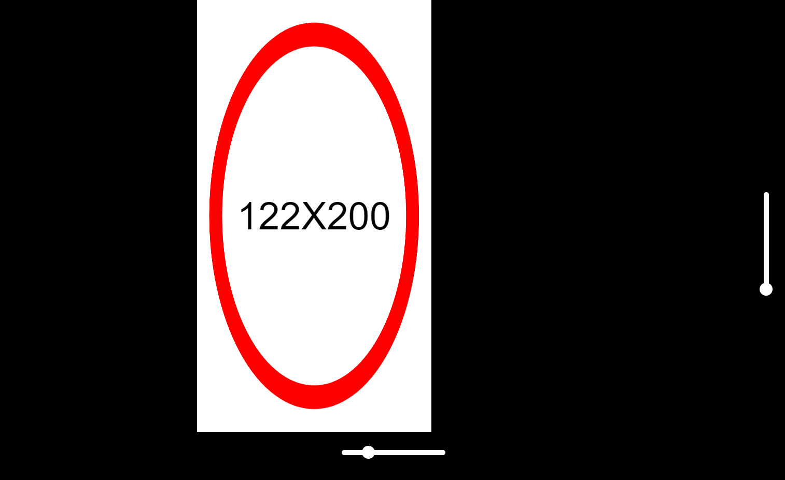
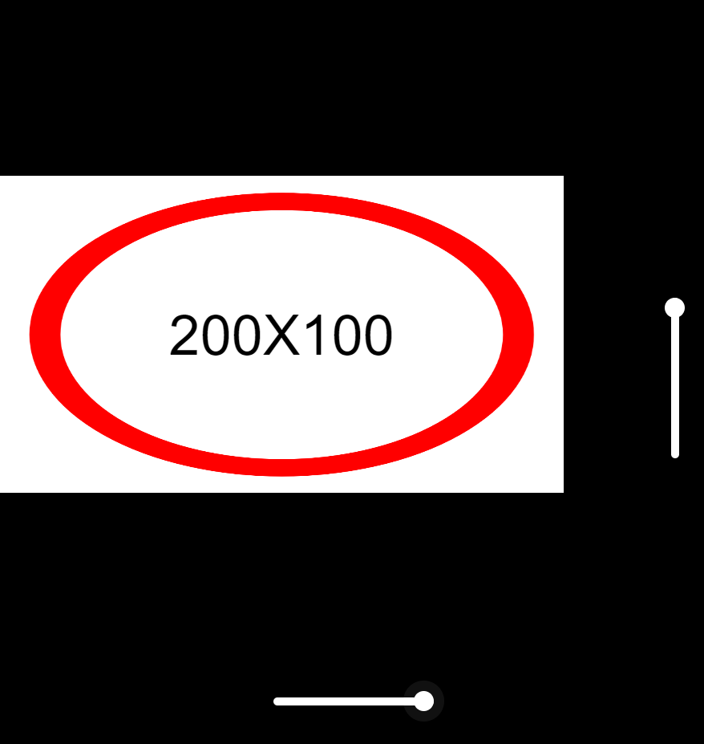

<!-- PROJECT LOGO -->
 

  

  <h3 align="center">HTML CANVAS RESIZE TEST</h3>

  

    An awesome HTML CANVAS ratio test!
     
    <a href="https://developer.mozilla.org/en-US/docs/Web/API/Canvas_API"><strong>Explore the docs »</strong></a>
     
     
    <a href="https://canvas-resize.netlify.app/">View Demo</a>
    ·
    <a href="https://github.com/CoryITpro/HTML-Canvas-Reisize/issues">Report Bug</a>
    ·
    <a href="https://github.com/CoryITpro/HTML-Canvas-Reisize/issues">Request Feature</a>
  

<!-- ABOUT THE PROJECT -->

# Achievement

To make the HTML5 canvas as big as possible, maintaining it's pixel ratio. And you can change the pixel ratio of canvas dynamically using two sliders at the right and bottom.

# About The UI

-   Main Canvas `containing the red circle`.
-   Two sliders `right one control the height of the canvas - and bottom one is for the width`.
-   The text - `Displays the pixel ratio of the canvas`.

# About the script function

## Initializing

      const ratio = { width: 200, height: 100 };

To set the canvas pixel ratio 200 \* 100 and it is used as the static variable representing the canvas ratio.

## Draw function `main core of this project`.

-   first calculate the pixel ratio of window and canvas for the comparison.

          const windowRatio = window.innerWidth / window.innerHeight;
          const canvasRatio = ratio.width / ratio.height;

-   compare ratios

    -   when canvasRatio > windowRatio

          

                c.style.width = `80vw`;  // set the width as full size
                const height = 90 / canvasRatio, c.style.height = `${height}vw`; // Set height to match canvasRatio

    -   when canvasRatio < windowRatio

          

                c.style.height = `90vh`; // set the height as full size
                const width = 80 * canvasRatio, c.style.width = `${width}vh`; // Set width to match canvasRatio

-   clear the canvas and this function is for the redrawing of the canvas.

          ctx.clearRect(0, 0, 1000, 1000);

-   redraw the circle

          ctx.beginPath();
          ctx.lineWidth = 55;   // linewidth of the circle
          ctx.strokeStyle = "red";   // color of the circle
          ctx.arc(500, 500, 420, 0, 2 \* Math.PI);  // draw line which is radius is 420 at the (500, 500) UV position of the canvas.
          ctx.stroke();
          ctx.save();

-   this function is to change the center text to canvas ratio property.

          text.innerHTML = `${ratio.width}X${ratio.height}`;

## Event listenders `user control`.

-   It's happen once you make change in the right side slider and the usage is to change the height value of static ratio variable.

            document.querySelector("#range2").addEventListener("input", (event) => {
              ratio.height = event.target.value;
              draw();
            });

-   It's happen once you make change in the bottom side slider and the usage is to change the width value of static ratio variable.

          document.querySelector("#range1").addEventListener("input", (event) => {
              ratio.width = event.target.value;
              draw();
          });

-   Redraw the canvas once you resize the browser window.

          window.addEventListener("resize", () => {
              draw();
          });
